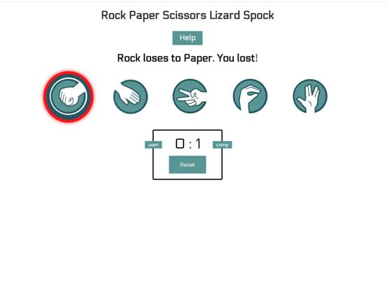
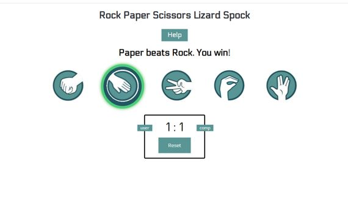
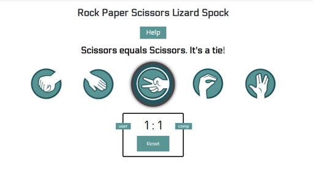
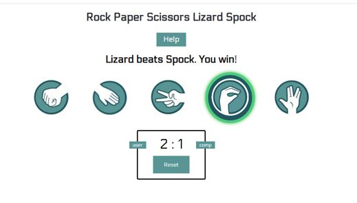
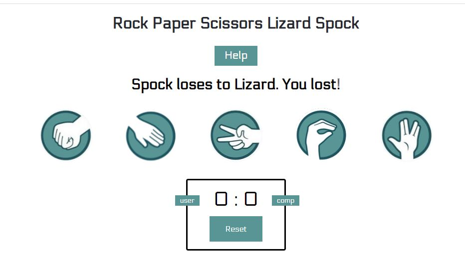
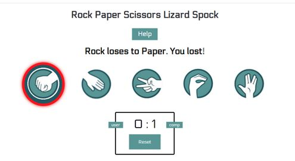

# Rock Paper Scissors Lizard Spock
(Developed by Daniel Lyons)

"Rock Paper Scissors Lizard Spock" is fun variation of the old classic "Rock Paper Scissors" game, where randomness and chance determine the winner. The live game can be played [here](https://chancandan.github.io/portfolio-project-2/)


## Product Goals 

### User Goals
- Play and learn a new variation on an old classic game
- Beat the game / device
- Enjoy themselves

### Developer / Product owner goals
- Protray a different variation of an old classic game
- Capture the user's attention
- Leave the user feeling joy and wanting to play the game again or return at a later time to play again

## User experience (UX)

### Expecations of the user

- Accessibility
- Visually appealing design and game layout
- Simple and working game mechanics
- A joyful and fun experience

### Target Audience

- Kids
- People who enjoy games
- People in search of games with a twist
- People who enjoy simple fun games

## User Stories

### Game / site user

#### First time user

* As a first time user, I want to be able to easily understand how to play the game.
* As a first time user, I would like to be able to see my score and know if I had a higher score that the computer / device.
* As a first time user, I would like the option to start over and reset the score if I felt I got off to a bad start.

#### Returning user goals

* As a returning user, I would like to quickly be able to start a new game.

# Features

## Existing Features

### Title

A simple heading displaying the game name in a font that is in a design often used in gaming realted content called "Electrolize.


### Help / Game rules

A button witht he text "Help" that calls a pop out modal that lists the rules of the game and which weapon trumps another. The modal fading everything outside of the pop out box so as to engage the user with the content in the rules section. There is an "X" for users to click to close this box or they can just click anywhere on the screen outside of the white content box to close it.


Scissors cuts paper.
Paper covers rock.
Rock crushes lizard.
Lizard poisons Spock.
Spock smashes scissors.
Scissors decapitates lizard.
Lizard eats paper.
Paper disproves Spock.
Spock vaporizes rock.
Rock crushes scissors.


### Game outcome feedback

The result of the game in text as feedback to user as to the outcome of the latest game played, e.g. "Rock loses to paper. You lost!"


### Game weapons / choices

The selection of weapons including rock, paper, scissors, lizard, spock. Displayed in icon format. Taken from images, resized, backgrounds removed using https://www.fotor.com/photo-editor-app/ and saved as PNG files.


### Color highlighted winner or loser

If the user has won a green border will encircle the winning weapon and similary a red border will encirlce a losing weapon. A gray circle will appear for a tie game.


### Scoreboard and reset button

An area where both the user and device scores are recorded and updated after each game. 
A reset button which will start a new match and reset both the user and device scores to zero.


### Future feautres

* A timer to create a game whereby the first player to reach a certain score before the timer runs out wins the game.
* A function to hide the other weapon options the user didn't choose.
* The highlighting of the weapon choosen by the device.

# Technologies used
* [HTML](https://en.wikipedia.org/wiki/HTML5) 
* [CSS](https://en.wikipedia.org/wiki/CSS)
* [Javascript](https://en.wikipedia.org/wiki/JavaScript)
* [W3C CSS Validator](https://jigsaw.w3.org/css-validator/validator)
* [W3C HTML Validator](https://validator.w3.org/#validate_by_input)
* [JS Hint Validator](https://jshint.com/)

### Design
* [Fotor](https://fotor.com/photo-editor-app/)
* [Gitpod](https://gitpod.io)
* [Github](https://github.com/)
* [Balsamiq](https://balsamiq.com/)
* [Google Fonts](https://fonts.google.com/)
* [Favicon](https://favicon.io/favicon-converter/)
* [Tinyjpg](https://tinyjpg.com)

# Testing

### Responsiveness

All pages were tested to ensure responsiveness on screen sizes from 320px and upwards as defined in [WCAG 2.1 Reflow criteria for responsive design](https://www.w3.org/WAI/WCAG21/Understanding/reflow.html) on Google Chrome, MicrosoftEdge, Mozilla Firefox and Safari.

Steps to test:

1. Open browser and navigate to [Rock Paper Scissors Lizard Spock](https://chancandan.github.io/portfolio-project-2/)
2. Open the developer tools (right click and inspect)
3. Set to responsive and decrease width to 320px
4. Set the zoom to 50%
5. Click and drag the responsive window to maximum width

Expected:

Website is responsive on all screen sizes and no images are pixelated or stretched.
No horizontal scroll is present.
No elements overlap.

Actual:

Website behaved as expected on all browsers.

Website was also opened on the following devices and no responsive issues were present seen:

- HP Laptop 15 -bs1xx
- Lenovo Chromebook
- iPhone SE
- iPhone X
- iPhone 14 Pro Max
- iPad (6th Generation)
- MacBook Air

### Lighthouse

The site was taken through Google Chrome's Lighthouse testing.


## Event Listener and Button Testing

- When each weapon choice button is clicked it triggers an event. All these different premutations of possible out comes were tested and all worked perfectly in testing.
- Below each button can be seen in the testing phase. A button is click and an event listeners calls that weapon and determines if the user has won or lost. A glow of either green for a win, red for a loss or gray should then surround the selected weapon button to give the user feedback on the game outcome. First, is the rock test. It is clicked and the test above the weapons reads "Rock (our choice) loses to Paper (the computer's choice)." Followed by the game outcome in text. This is for accessibility incase a user is color blind they might not be able to see which color glow surrounds the weapon. However, in the image below the red glow can be see as a border glow around our losing choice of rock. This will display for just 1.5 seconds and disappear and the game match is ready to continue. The scoreboard is also tested here and we can see that it updates correctly. The user receives no point because they lost and the device or computer picks up 1 point for their win and this is added to the counter.



- Next the paper button is tested in the image bleow. Again, the correct weapon choice displays in the text feedback above the icon buttons and this time we win by beating rock.
- The score board is also working correctly for each time the user wins by adding 1 point to our side of the score. The green glow surrounding paper represents us winning.



- For the next test I choose scissors and again the game is working perfectly and this time the game is a tie which is great as that was the only outcome left to test. We can see in the feedback text that scissors equals scissors and there is a gray color glow around our button icon to show that it's a draw. Also we can see that the score remains at 1-1 and this is great as a tie does not add a point to either player and the should should not increment.



- Lizard is tested next in the image below. The user wins this time and feedback test is updated correctly, along with the scoreboard which now reads 2-1 to the user. The green winning glow works and it fades away after 1.5 seconds.



- The final button choice to test is Spock. The button works perfectly as does the feedback text. The score reads 3-2 in the image, however I must add, that I clicked an extra click before this text where the score went to 2-2. Despite the break in image patterns the score board is working correctly. 
- Therefore, all game buttons are working correctly.
- The scoreboard is updating the relevant scores in the right way.
- The feedback text for accessibility reasons is working fine.
- The glow borders are all working in the correct manner and are disappearing when they should be.

- The next item to test is the rest button and in the image below you can see after I click the rest button it resets both the user and computer score back to zero.



- One error that I have since debugged is that new I would reset the scores back to zero they would reset correctly, however, when I clicked a weapon button for a new match to begin the score would increment from the last score in the previous match. For example a match that had a score  of 9 : 8 would reset back to 0 : 0 but when I started a new match and lets say my firs game weapon choice lost then the score board would read 9 : 9. I knew that my innerHTML was reseting correctly but I had to code my Javascript to reset the userChoice and computerChoice too. After I made these changes the scoreboard worked correctly in every way, as can be seen in the image below when I click Rock to start a new match, I lose and score is updated correctly to signify a new match has begun.



- I have show above in this README that the modal Help button is also working correctly, therefore, all aspects of the game have been tested and everything is working as it should.

## Deployment

### Deployment to Github Pages

- The Rock Paper Scisscors Lizard Spock game site was deployed to GitHub pages. The following steps were taken when deploying: 
  - Navigate to the Settings tab in the GitHub repository 
  - Select 'Pages' from the menu on the left of the screen
  - Select the 'Branch: main' option from the drop-down menu in the source section
  - Then click 'Save'
  - After a short wait a live link will be appear in a green banner when published successfully. 

The game's live link can be found here - https://chancandan.github.io/portfolio-project-2/

### Version Control

During the development of the site, When pushing code to the remote repository, I used the following git commands 

```git add .``` - All files added to a staging area awaiting the commit phase.

```git commit -m “specific commit message”``` - To commit changes to the local repository queue where they become ready for the push phase.

```git push``` - All commited code would be then pushed to the site's repo on github.

### Validator Testing 

- HTML Validation
- All files returned no errors when passed through the official [W3C validator](https://validator.w3.org/nu/?doc=https%3A%2F%2Fchancandan.github.io%2Fportfolio-project-2%2F)


- CSS Validation
- No errors were found when passing through the official [(Jigsaw) validator](https://jigsaw.w3.org/css-validator/validator?uri=https%3A%2F%2Fchancandan.github.io%2Fportfolio-project-2%2F&profile=css3svg&usermedium=all&warning=1&vextwarning=&lang=en)


- Javascript Validation
- To verify that my Javascript code was written to the best possible standard I used the JSHint validator to test my JS file. The only errors I had were 5 missing semi-colons which I added into my code and one unused variable which I must have included in the beginning of the project and had forgotten to remove.


## Credits and Acknowledgements

A variety of contributors and help went into the development this website:

* The images used for the weapon choices were from a google search. They didn't all come from the same site, despite being from the same style collection. Site's search as https://icon-library.com/ are be acknowledged.

* The font used "electrolize" was taken from google fonts.

* Modal code was learned from https://www.w3schools.com/howto/howto_css_modals.asp

* The geeksforgeeks website helped me understand the logic behind the game I chose. https://www.geeksforgeeks.org/rock-paper-and-scissor-game-using-javascript/

* https://www.instructables.com/How-to-Play-Rock-Paper-Scissors-Lizard-Spock/ helped me to work out the permutations and rules to be included in my site.

* Youtube tutorial https://www.youtube.com/watch?v=1yS-JV4fWqY

* Youtube page https://www.youtube.com/@Zenva for inspiration and ideas

* Youtube tutorial https://www.youtube.com/watch?v=qWPtKtYEsN4 was another tutorial I watched to gain an understanding of how to use javascript for my project.

* @AniaKubow's content has been great throughout the javascript module in helping me to better grasp the language.

* My class and course facilitator have been great help in our slack group during this project.

* Youtube tutorial https://www.youtube.com/watch?v=jaVNP3nIAv0 for help on a score counter.

* Finally, my mentor Gareth has been great in helping me clearly understand the project brief and nudging me in the right direction when I've come unstuck.

